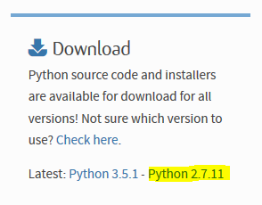
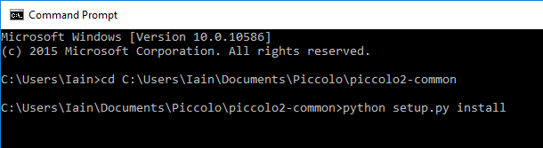

**********
Installing
**********

The Piccolo includes a Raspberry Pi which runs *Piccolo Server*. This software controls the Piccolo's hardware (spectrometers, shutters, ...), handles the recording of data, and provides an application programming interface that can be used to control the Piccolo. The Piccolo is usually remotely-controlled from a laptop via a network or radio link.

The Piccolo software is installed on the memory card of the Raspberry Pi that is included with the Piccolo. These instructions are therefore not required for a new instrument. The procedure described here can be used to install the software on a new memory card.

========
Raspbian
========

The Raspberry Pi is a miniature computer which runs an operating system, *Raspbian*, which is a variant of Linux.

*Raspbian* can be obtained from the `downloads page <https://www.raspberrypi.org/downloads>`_ at the `Raspberry Pi Foundation <https://www.raspberrypi.org/>`_. At the time of writing, the latest version is *Raspbian Jessie*, released on 18th March 2016. (*Raspbian Jessie Lite* has not been tested with the Piccolo.)

Download the zip (or Torrent) file and follow `their instructions <https://www.raspberrypi.org/documentation/installation/installing-images/README.md>`_ instructions to image it onto a memory (SD) card.

==============
Python version
==============

The Piccolo software is written for Python 2.7.

==================
Network connection
==================

To install the required software the Raspberry Pi must be connected to the Internet so that it can download software and updates. There are some `notes on Bitbucket <https://bitbucket.org/itrobinson/piccolo/wiki/Setting%20up%20a%20wired%20%28Ethernet%29%20connection%20to%20the%20Piccolo>`_ about how to set up the network connection.

To test the network connection, type::

  ping www.google.com

==========================
Run the configuration tool
==========================

This step is optional, but recommended.

Use the `Raspberry Pi configuration tool <https://www.raspberrypi.org/documentation/configuration/raspi-config.md>`_ to perform these actions:

* Expand the filesystem
* Change the user password
* Disable boot to desktop

Select ``Expand Filesystem``.

Select ``Change User Password`` and enter a new password. The default password is ``raspberry``, but this may be insecure if the Raspberry Pi is connected to a network.

Select ``Boot Options`` and then ``Console Autologin``.

Select any other custom configuration required.

Select ``Finish``. When asked ``Would you like to reboot now?``` answer ``Yes``.

=============================
Check packages are up to date
=============================

The ``apt-get`` tool allows software to be installed onto the Raspberry Pi directly from its internet connection. To do this it maintains a local package list which needs occasionally to be updated. Type::

  sudo apt-get update

Enter the password when prompted. (If the The Raspberry Pi password was not changed in the previous step, it will still be ``raspberry``.)

=================
Install Mercurial
=================

This step is optional.

*Mercurial* is a source code management tool. It is useful to developers of the Piccolo software to quickly upload and download source code from `Bitbucket <http://bitbucket.org/>`_, the web site which holds the development version of the software.

To install Mercurial type::

 sudo apt-get install mercurial

If asked ``Do you want to continue? [Y/n]`` answer ``Y`` for yes.

============================
Install Piccolo common files
============================

*Piccolo Common* contains the specification of the *Pico* file format used by the Piccolo.

Copy the ``piccolo2-common`` files onto the Raspberry Pi and type::

 cd piccolo2-common
 sudo python setup.py install

The files are installed in ``/usr/local/lib/python2.7/dist-packages/piccolo2_common-0.1-py2.7.egg``.

==============
Install psutil
==============

The *psutil* Python module is required by Piccolo Server for monitoring. Type::

  sudo apt-get install python-psutil

This module must be installed with ``apt-get``.

=================
Install configobj
=================

*ConfigObj* is a Python module for reading configuration files, more often known as *ini* files on Windows systems. It is required by the Piccolo software to read the *server configuration file*. To install it type::

  sudo apt-get install python-configobj

=================
Install pyjsonrpc
=================

Type::

  sudo pip install python-jsonrpc

To test the installation::

  python
  import pyjsonrpc
  quit()

======================
Install Piccolo Server
======================

Copy the ``piccolo-server`` files onto the Raspberry Pi.

Type::

  cd piccolo-server
  sudo python setup.py install

This will use the Raspberry Pi's internet connection to download and install a number of Python modules.

If the following error mesage occurs::

  warning: no previously-included files matching '*' found under directory 'docs/_build'
  psutil/_psutil_linux.c:12:20: fatal error: Python.h: No such file or directory
  #include <Python.h>
                     ^
  compilation terminated.
  error: Setup script exited with error: command 'arm-linux-gnueabihf-gcc' failed with exit status 1

then go back to the previous step and ensure that ``psutil`` is installed.

As well as installing *Piccolo Server* a number of Python modules are downloaded form the internet and installed on the Raspberry Pi. These modules are used by *Piccolo Server*.

*CherryPy* is a small web framework for Python. It allows the Piccolo software to use an application programming interface based on popular and standard protocols designed for the world-wide web.

*docutils* is text processing system used that is commonly used to help with the preparation of documentation for Python modules.

*lockfile* handles file locking.

*pbr* is part of a tool for setting up and install Python modules.

*python-daemon* is used to create services which run in the background.

Most of the files are installed in the directory ``/usr/local/lib/python2.7/dist-packages/``.

===================
Test Piccolo server
===================

Before starting Piccolo server it is important to be in the correct directory so that it can find the configuration file. Type::

  cd /home/pi/piccolo2-server
  python piccolo2/pserver.py

Attempting to run ``pserver.py`` from any other directory will produce an error message::

  RuntimeError: no such configuration file /home/pi/Piccolo/piccolo2-server/piccolo2/pdata/piccolo.config

A number of messages should appear, including::

  Serving on http://localhost:8080
  Bus STARTED

This final message indicates that *Piccolo Server* is running, and that the address to which commands should be sent is (the default)::

  http://localhost:8080

Type Ctrl-C to terminate *Piccolo Server*. This typically takes a few seconds.

==============================
Select the IP address and port
==============================

Whilst Piccolo Server is running on (*binding to*) the ``localhost`` address (usually ``127.0.0.1``) it will not (at least not always) be accessible to other machines on the network. To remedy this, Piccolo Server needs to run on the Internet Protocol (IP) address of the Raspberry Pi.

To find out the IP address of the Raspberry Pi type::

 ip addr

The result of this command is a list of network interfaces. The IP address should be in this list. This will be different for different networks. As an example, if the Raspberry Pi is connected to the network wirelessly, the IP address will be given under the wireless adapters list ``wlan0``::

 3: wlan0: <BROADCAST,MULTICAST,UP,LOWER_UP> mtu 1500 qdisc mq state UP group default qlen 1000
     link/ether a0:f3:c1:1d:ff:b0 brd ff:ff:ff:ff:ff:ff
     inet 172.16.1.113/24 brd 172.16.1.255 scope global wlan0
        valid_lft forever preferred_lft forever
     inet6 fe80::e4ec:c07:79ff:92d7/64 scope link
        valid_lft forever preferred_lft forever

In the above case, the IP address of the Raspberry Pi is ``172.16.1.113``.

To verify that the correct IP address has been identify, try using it to connect to the Raspberry Pi with secure shell::

 ssh pi@172.16.1.113

If this opens a connection to the Raspberry Pi this confirms that ``172.16.1.113`` is the IP address of the Raspberry Pi (and not some other device on the network).

==================
Run Piccolo Server
==================

Run Piccolo Server on the IP address of the Raspberry Pi::

 python piccolo2/pserver.py -u http://172.16.1.113:8885

In the above ``8885`` is the port number to run the server on. The server can be run on any port that is not being used by another service. The default port is ``8080``.

==================================
Install Python on a Windows laptop
==================================

There are several versions of Python available for Windows. This documentation covers only one version, but it should work with any. The Windows laptop must have an internet connection in order to install the Python modules.

Download and install Python from the `Python web site <http://www.python.org>`_. The ``Windows x86-64 MSI installer`` is the easiest to install.



Python can be installed to any directory. This documentation assumes it is installed in the default directory ``C:\Python27``.

============================
Install Piccolo common files
============================

Download the ``piccolo2-common`` files to the Windows laptop. Open a ``Command Prompt`` and type::

  cd C:\Users\Iain\Documents\Piccolo\piccolo2-common
  python setup.py install

Replace ``\Users\Iain\Documents\Piccolo\piccolo2-common`` in the above with the path to the directory containing ``piccolo2-common``.



This will install the Piccolo common files as an *egg file* in ``C:\Python27\Lib\site-packages\piccolo2-common-0.1-py2.7.egg``. An egg file is a compressed archive containing Python code.

======================
Install Piccolo Client
======================

Download the ``piccolo2-client`` files to the Windows laptop. Open a ``Command Prompt`` and type::

  cd C:\Users\Iain\Documents\Piccolo\piccolo2-client
  python setup.py install

This will download some additional Python modules from the internet and install them:

* *python-jsonrpc*
* *bunch*

The *Python JSON RPC module* was described in a previous step. *bunch* is data structure used by Piccolo Client.

The downloaded modules and the *Piccolo Client* egg file (``piccolo2_client-0.1-py2.7.egg``) will be installed in ``C:\Python27\Lib\site-packages``.

============
Install PyQt
============

*PyQt* is a module for creating graphical user interfaces in Python using the `Qt <http://www.qt.io>`_ application framework.

Piccolo Player requires a module called pyqt-distutils. Install it first.

On the Windows laptop type::

 pip install pyqt-distutils

Download and install PyQt. Qt is available for several different versions of Python. The Piccolo software is written in Python version 2.7, so download the installer for version 2.7 of Python.

The installer installs the files in ``C:\Python27\Lib\site-packages\PyQt4``.

.. image:: images/screenshots/windows_pyqt_download.png

======================
Install Piccolo Player
======================

Copy the ``piccolo-player`` files onto the Windows laptop and type::

 cd C:\Users\Documents\Piccolo\piccolo2-player
 python setup.py install

Replace ``C:\Users\Documents\Piccolo\piccolo2-player`` in the above with the path to which the ``piccolo2-player`` was copied.

======================
Compile user interface
======================

Use ``pyuic4`` to compile the user interface files (which have the ``.ui`` extension) into Python files::

 cd C:\Users\Iain\Documents\Piccolo\piccolo2-player\piccolo2\player
 C:\python27\Lib\site-packages\PyQt4\pyuic4 connect.ui -o connect_ui.py
 C:\python27\Lib\site-packages\PyQt4\pyuic4 player.ui -o player_ui.py
 C:\python27\Lib\site-packages\PyQt4\pyuic4 schedulelist.ui -o schedulelist_ui.py
 C:\python27\Lib\site-packages\PyQt4\pyuic4 schedule.ui -o schedule_ui.py

==================
Install Matplotlib
==================

The *Matplotlib* module is used to plot graphs in Python. Use *pip* to install *Matplotlib*::

  C:\python27\Scripts\pip install matplotlib

==================
Run Piccolo Client
==================

Run *Piccolo Client* by typing::

 cd C:\Users\Iain\Documents\Piccolo\piccolo2-client
 python piccolo-client.py -u http://172.16.1.113:8885

In the above, replace ``172.16.1.113`` with the IP address of the Raspberry Pi, and ``8885`` with the port that Piccolo Server is running on.

*Piccolo Client* will attempt to connect to *Piccolo Server* over the network. If the connection is successful, an output similar to this will be displayed::

 [u'piccolo', u'upwelling', u'S___many__', u'scheduler', u'downwelling']
 {u'status': u'idle', u'datadir': u'not mounted', u'virtual_memory': {u'used': 245760, u'percent': 0.2, u'free': 104607744, u'sout': 245760, u'total': 104853504, u'sin': 0}, u'hostname': u'raspberrypi', u'cpu_percent': 55.7}
 pong
 njobs 0
 scheduled
 njobs 1
 {u'jid': 0, u'at_time': u'2016-04-22T22:19:01', u'interval': 5.0, u'job': [u'ping', u'piccolo', {}], u'end_time': u'2016-04-22T22:19:31', u'suspended': False}
 False

 The ``piccolo-client.py`` script by default instructs the Piccolo to start recording some spectra.
