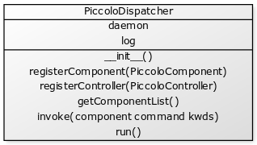

***********
Programming
***********

The Piccolo has an application programming interface (API).

The API uses `CherryPy <http://www.cherrypy.org/>`_.

==========
Dispatcher
==========

The dispatcher is a Python object (class name ``PiccoloDispatcher``) that receives instructions from the laptop or other sources and passes them on the instruments. There can only be one dispatcher running at any one time. It is possible to run the dispatcher in a background thread.

