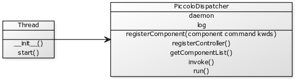

***********
Programming
***********

The Piccolo has an application programming interface (API).

The API uses `CherryPy <http://www.cherrypy.org/>`_.

=========
Bitbucket
=========

This section is optional.

The `Bitbucket web site <http://bitbucket.org/>`_ is used to manage the open source Piccolo code. The Piccolo software is written entirely in the Python programming language. The Python modules which control and operate the Piccolo are open source. The hardware drivers for USB spectrometers, radios and shutters are closed source.

As the Piccolo is distributed with open source software users may wish to modify or customize the included software to suit their own applications. *Bitbucket* is a web site that maintains a copy of the Piccolo source code and tracks any changes users' make to the code. It enables users who wish to to share their changes to the Piccolo source code, or additional software they have written, with other users. It is though not essential to use *Bitbucket* in order to operate or program the Piccolo.

Version control software is required to use *Bitbucket*. The software synchronizes a copy of the Piccolo source code on a computer with the Bitbucket server. *Mercurial* (abbreviated ``hg`` after the chemical symbol for mercury) is the version control system used for the Piccolo. To copy code changes to the Piccolo server it must be installed on the computer. It can also be installed on the Raspberry Pi, if the Pi has a network connection. For instructions on installing Mercurial on the Raspberry Pi see the :ref:`installing-mercurial` section of the installation guide.

A Bitbucket account is required.

To commit a change to Bitbucket type::

  hg commit -u "Iain Robinson <iain@physics.org>"

replacing ``Iain Robinson <iain@physics.org>`` with the name and email address used in your Bitbucket account.

This will open a text editor such as *Windows Notepad* or *nano*. Enter a commit message that describes the changes.

.. attention:: Ensure your name and email address in above ``commit`` command are identical to those used for your *Bitbucket* account.

The name and email address are used by Bitbucket to connect the commit message with the user account. To find out your usename and email address log into Bitbucket and click the user icon as shown below.

.. hint:: You edit your Mercurial settings file (``.hgrc``) to include your name, email address, default text editor and other settings.

=============
Spectrometers
=============

Spectrometers have a name that is based on their serial numbers.

========
Channels
========

The Piccolo is a dual-field-of-view spectrometer system and therefore has two (or possibly more) light inputs. These are referred to as *channels* and in most configurations there are two channels defined:

* upwelling
* downwelling

Channel names may be case sensitive.

==========
Dispatcher
==========

The dispatcher is a Python object (class name ``PiccoloDispatcher``) that receives instructions from the laptop or other sources and passes them on the instruments. There can only be one dispatcher running at any one time. It is possible to run the dispatcher in a background thread.

A class diagram for ``PiccoloDispatcher`` is shown below. As ``PiccoloDispatcher`` is designed to be run in the background as a separate thread, it inherits from Python's built-in ``Thread`` class from the ``threading`` module.

The dispatcher by itself does not handle any hardware. Instead a number of *components* must be registered with it before they can be used. In principle any components can be registered with the dispatcher. Below is an example of the:

#. An upwelling shutter
#. A downwelling shutter
#. An Ocean Optics USB2000+ spectrometer
#. The Piccolo Component
#. The Controller

==========
Controller
==========

The controller contains:

#. The data directory
#. shutters
#. spectrometers

The interface to the data directory is provided by an object of class ``PiccoloDataDir``.

The controller receives instructions and puts them into a queue.

A subclass of ``PiccoloController`` is ``PiccoloControllerCherryPy`` which provides an interface for Remote Procedure Calls (RPC) written in Javascript Object Notation (JSON). This provides a web-like API for the Piccolo.

=========
Scheduler
=========

In logging applications it is required to acquire data at defined times. The scheduler provides an object to do this. Items (jobs) can be added to the scheduler with a specified start time.

===================
Starting the server
===================

Starting *Piccolo Server* goes through the following setup steps:

#. Reads the *server configuration file*.
#. Sets up a log file.
#. Creates the *data directory*.
#. Initializes (but doesn't start) the dispatcher.
#. Reads the *instrument configuration file*.
#. Initializes the shutters.
#. Registers the shutters with the dispatcher.
#. Finds and initializes all (USB-connected) spectrometers, then registers them with the dispatcher.
#. Sets up the *Piccolo Component* and registers it with the dispatcher.
#. Initializes the controller and registers it with the dispatcher.
#. Starts the dispatcher.
#. Starts the *CherryPy* server with the conroller.
